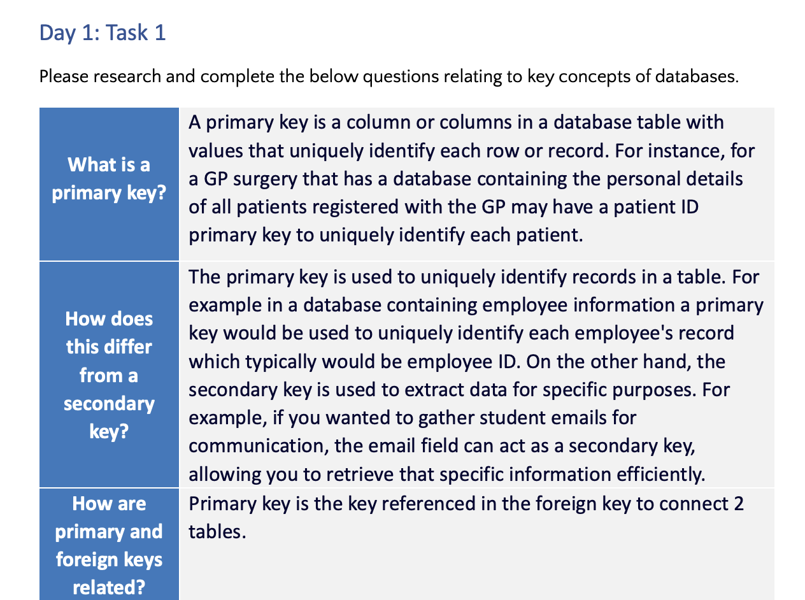

# Week 3 SQL
In Week 3, I learned about relational and non-relational databases, including the key differences between them. I explored important terminology in database systems, such as tables, schemas, and keys, essential for understanding data organisation and relationships. I gained insight into SQL (Structured Query Language), including how to write SQL code for managing and querying data. Additionally, I learned how to implement data manipulation techniques as well as data filtering methods to retrieve specific information from databases. Moreover, I was introduced to the different types of joining and learnt how to filter by null values.

**Knowledge gained:**
- What SQL is
- How to write SQL code
- Difference between relational and non-relational databases
- Key terminology of database systems and their importance
- How to implement data manipulation and filtering
- Join types
- How to work with subqueries
- How to work with null values

